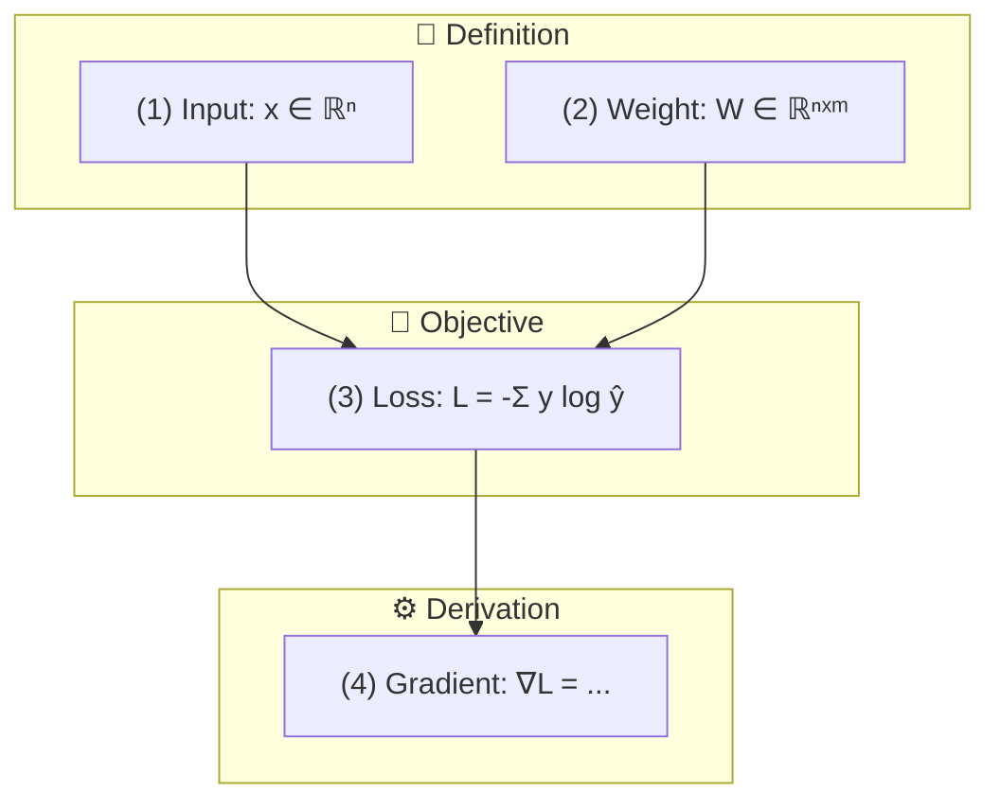

# Paper Formula MCP Server

논문의 수학적 수식을 분석하고 **Mermaid 다이어그램**으로 시각화하는 MCP 서버입니다.

## 주요 기능

### 📐 수식 분석
- **수식 추출**: PDF 논문에서 LaTeX 수식 자동 추출
- **역할 분류**: 정의, 목적함수, 제약조건, 정리, 유도 등 8가지 역할 자동 분류
- **수식 설명**: LLM을 활용한 상세 설명 생성 (한국어/영어)

### 📊 다이어그램 생성
- **수식 의존성 그래프**: 수식 간 의존 관계 시각화
- **개념 관계도**: 핵심 개념들의 관계 분석
- **논문 발전 관계**: 참조 논문과의 관계 타임라인
- **역할 흐름도**: Definition → Objective → Derivation → Theorem

## 설치

```bash
cd paper-formula-mcp
npm install
npm run build
```

## 환경 설정

`.env` 파일을 생성하고 OpenAI API 키를 설정하세요:

```
OPENAI_API_KEY=your_openai_api_key_here
```

## MCP 클라이언트 설정

Claude Desktop의 `claude_desktop_config.json`에 추가:

```json
{
  "mcpServers": {
    "paper-formula": {
      "command": "node",
      "args": ["C:/Users/정화민/Desktop/MCP_hwamin/paper-formula-mcp/dist/index.js"]
    }
  }
}
```

## 도구 목록

### 1. `extract_formulas`
PDF 논문에서 수식 추출 및 역할 분류

```
입력: pdfPath, includeInline, includeNumbered
출력: 수식 목록 + 역할별 분류 + 통계
```

### 2. `explain_formula`
수식의 의미와 역할을 상세히 설명

```
입력: pdfPath, formulaId 또는 latex, detailLevel, language
출력: 요약, 구성요소, 의미, 직관적 이해, 역할
```

### 3. `generate_formula_dependency`
수식 간 의존성을 Mermaid 다이어그램으로 생성

```
입력: pdfPath, direction, includeVariables
출력: Mermaid flowchart + 분석 결과
```

### 4. `generate_concept_map`
논문의 핵심 개념 관계도 생성

```
입력: pdfPath, maxConcepts, relationTypes
출력: Mermaid 다이어그램 + 개념 목록
```

### 5. `generate_evolution_diagram`
논문 간 발전/영향 관계도 생성

```
입력: pdfPath, additionalPapers, depth
출력: 타임라인 다이어그램 + 관계 분석
```

### 6. `analyze_formula_variables`
변수 정의 및 사용 현황 분석

```
입력: pdfPath, outputFormat (mermaid/table/json)
출력: 변수별 정의/사용 위치 + 통계
```

### 7. `analyze_formula_roles`
수식 역할 분석 및 논리 흐름도 생성

```
입력: pdfPath, groupByRole, showFlow
출력: 역할별 그룹 + 흐름 다이어그램
```

## 수식 역할 분류

| 역할 | 설명 | 키워드 |
|------|------|--------|
| 📘 Definition | 새로운 개념/변수 정의 | define, let, denote |
| 🎯 Objective | 최적화할 목적 함수 | minimize, maximize, loss |
| 🔒 Constraint | 제약 조건 | subject to, s.t. |
| 📐 Theorem | 주요 정리/결과 | theorem, proposition |
| ⚙️ Derivation | 다른 수식에서 유도 | from, therefore, thus |
| ≈ Approximation | 근사/추정 | approximately, ≈ |
| 💡 Example | 설명을 위한 예시 | for example, e.g. |
| 📊 Baseline | 비교 기준 | baseline, previous |

## 출력 예시

### 역할 흐름도


## 기술 스택

- TypeScript
- @modelcontextprotocol/sdk
- OpenAI API (GPT-4o)
- pdf-parse

## 라이선스

MIT
