# Paper Formula MCP Server

논문의 수학적 수식을 분석하고 **Mermaid 다이어그램**으로 시각화하는 MCP 서버입니다.

## 주요 기능

### 📐 수식 분석
- **수식 추출**: PDF 논문에서 LaTeX 수식 자동 추출
- **역할 분류**: 정의, 목적함수, 제약조건, 정리, 유도 등 8가지 역할 자동 분류
- **수식 설명**: LLM을 활용한 상세 설명 생성 (한국어/영어)

### 📊 다이어그램 생성
- **수식 의존성 그래프**: 수식 간 의존 관계 시각화
- **개념 관계도**: 핵심 개념들의 관계 분석
- **논문 발전 관계**: 참조 논문과의 관계 타임라인
- **역할 흐름도**: Definition → Objective → Derivation → Theorem

### 📖 교과서 생성
- **자동 교과서**: 논문 수식에서 기초→심화 교과서 자동 생성
- **인터랙티브 마법사**: 수준, 언어, 스타일 등 단계별 설정
- **연습문제 포함**: 풀이과정과 답이 포함된 연습문제 자동 생성

### 🎯 HOW-WHY-WHAT 가이드
- **학습 가이드 생성**: 논문 마크다운에서 WHAT/WHY/HOW 프레임워크 가이드 생성
- **실전 코드 포함**: PennyLane/PyTorch 코드 예시
- **공모전/논문 활용**: 공모전 활용법, 논문 작성 팁, 확장 아이디어

## 설치

```bash
cd paper-formula-mcp
npm install
npm run build
```

## 환경 설정

`.env` 파일을 생성하고 OpenAI API 키를 설정하세요:

```
OPENAI_API_KEY=your_openai_api_key_here
```

## MCP 클라이언트 설정

Claude Desktop의 `claude_desktop_config.json`에 추가:

```json
{
  "mcpServers": {
    "paper-formula": {
      "command": "node",
      "args": ["C:/Users/정화민/Desktop/MCP_hwamin/paper-formula-mcp/dist/index.js"]
    }
  }
}
```

## 도구 목록

### 1. `extract_formulas`
PDF 논문에서 수식 추출 및 역할 분류

```
입력: pdfPath, includeInline, includeNumbered
출력: 수식 목록 + 역할별 분류 + 통계
```

### 2. `explain_formula`
수식의 의미와 역할을 상세히 설명

```
입력: pdfPath, formulaId 또는 latex, detailLevel, language
출력: 요약, 구성요소, 의미, 직관적 이해, 역할
```

### 3. `generate_formula_dependency`
수식 간 의존성을 Mermaid 다이어그램으로 생성

```
입력: pdfPath, direction, includeVariables
출력: Mermaid flowchart + 분석 결과
```

### 4. `generate_concept_map`
논문의 핵심 개념 관계도 생성

```
입력: pdfPath, maxConcepts, relationTypes
출력: Mermaid 다이어그램 + 개념 목록
```

### 5. `generate_evolution_diagram`
논문 간 발전/영향 관계도 생성

```
입력: pdfPath, additionalPapers, depth
출력: 타임라인 다이어그램 + 관계 분석
```

### 6. `analyze_formula_variables`
변수 정의 및 사용 현황 분석

```
입력: pdfPath, outputFormat (mermaid/table/json)
출력: 변수별 정의/사용 위치 + 통계
```

### 7. `analyze_formula_roles`
수식 역할 분석 및 논리 흐름도 생성

```
입력: pdfPath, groupByRole, showFlow
출력: 역할별 그룹 + 흐름 다이어그램
```

### 8. `generate_textbook`
논문 수식 기반 교과서 생성

```
입력: pdfPath, targetLevel, language, maxChapters, includeExercises, includeExamples, focusFormulas, outputPath
출력: 마크다운 교과서 + 통계
```

### 9. `start_textbook_wizard`
인터랙티브 교과서 생성 마법사 시작

```
입력: pdfPath
출력: 세션 ID + 1단계 질문 (수준 선택)
```

### 10. `textbook_wizard_answer`
교과서 마법사 단계별 답변

```
입력: sessionId, answer
출력: 다음 단계 질문 또는 생성된 교과서
```

### 11. `start_interactive`
인터랙티브 기능 선택 마법사

```
입력: (없음)
출력: 사용 가능한 도구 목록 + 선택지
```

### 12. `interactive_answer`
인터랙티브 마법사 답변

```
입력: sessionId, answer
출력: 다음 단계 또는 실행 결과
```

### 13. `generate_how_why_what_guide`
논문 마크다운 파일에서 HOW-WHY-WHAT 프레임워크 학습 가이드 생성

```
입력: paperPath (.md), guideStyle (comprehensive/concise/practical), language (ko/en), includeCode, includeCompetition, outputPath
출력: 마크다운 가이드 (WHAT/WHY/HOW/핵심발견/코드/활용가이드/부록) + 통계
```

**가이드 구조:**
| 섹션 | 내용 |
|------|------|
| WHAT | 핵심 개념 3가지, 수식, 비유 |
| WHY | 기존 한계, 연구 동기, 장점 |
| HOW | 워크플로우, 단계별 설명, 알고리즘 |
| 핵심 발견 | 실험 결과, 실전 지침 체크리스트 |
| 실전 코드 | PennyLane/PyTorch 코드 예시 |
| 활용 가이드 | 공모전/논문 작성 팁, 확장 아이디어 |
| 부록 | 용어사전, 수식 모음, 참고자료 |

### 14. `start_guide_wizard`
인터랙티브 HOW-WHY-WHAT 가이드 생성 마법사

```
입력: paperPath (.md)
출력: 세션 ID + 1단계 질문 (스타일 선택)
```

### 15. `guide_wizard_answer`
가이드 마법사 단계별 답변

```
입력: sessionId, answer
출력: 다음 단계 질문 또는 생성된 가이드
```

## 수식 역할 분류

| 역할 | 설명 | 키워드 |
|------|------|--------|
| 📘 Definition | 새로운 개념/변수 정의 | define, let, denote |
| 🎯 Objective | 최적화할 목적 함수 | minimize, maximize, loss |
| 🔒 Constraint | 제약 조건 | subject to, s.t. |
| 📐 Theorem | 주요 정리/결과 | theorem, proposition |
| ⚙️ Derivation | 다른 수식에서 유도 | from, therefore, thus |
| ≈ Approximation | 근사/추정 | approximately, ≈ |
| 💡 Example | 설명을 위한 예시 | for example, e.g. |
| 📊 Baseline | 비교 기준 | baseline, previous |

## 출력 예시

### 역할 흐름도

```mermaid
flowchart TB
    subgraph "📘 Definition"
        d1["(1) Input: x ∈ ℝⁿ"]
        d2["(2) Weight: W ∈ ℝⁿˣᵐ"]
    end

    subgraph "🎯 Objective"
        o1["(3) Loss: L = -Σ y log ŷ"]
    end

    subgraph "⚙️ Derivation"
        der1["(4) Gradient: ∇L = ..."]
    end

    d1 & d2 --> o1
    o1 --> der1
```


## 기술 스택

- TypeScript
- @modelcontextprotocol/sdk
- OpenAI API (GPT-4o)
- pdf-parse

## 라이선스

MIT
